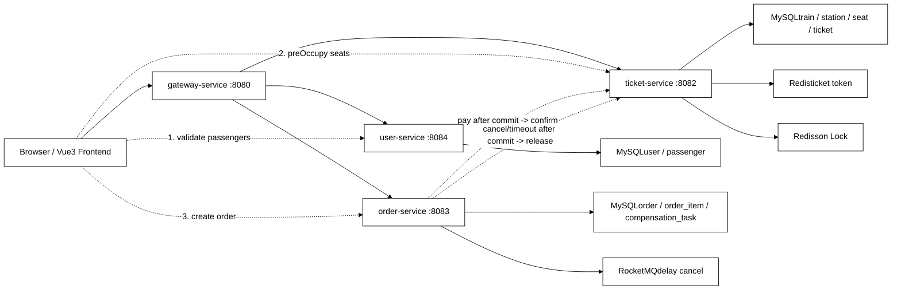
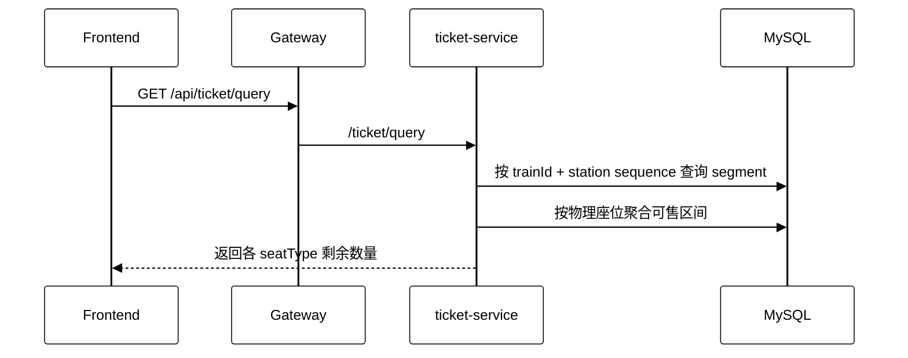
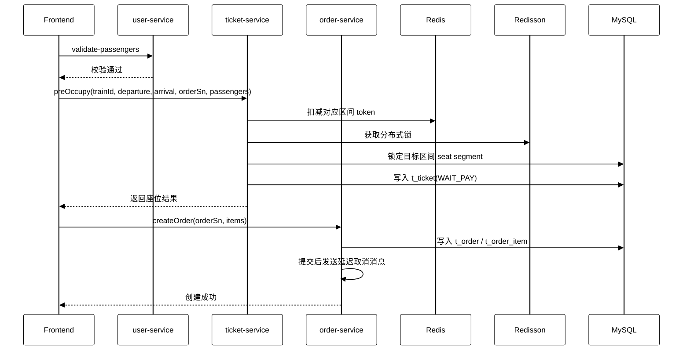

TickGo购票系统
# TickGo

> 简化版 12306 区间购票系统，聚焦“查票、预占、下单、支付确认、超时取消释放”主链路，重点演示区间库存建模、Redis token 前置拦截、分布式锁、MySQL 最终锁座、延迟消息和补偿任务等典型工程问题。

## 1. 项目简介

TickGo 不是普通 CRUD 项目，而是围绕火车票区间售卖场景做的最小可运行系统。

项目目标：

- 支持按 `出发站 -> 到达站` 查询余票
- 支持多乘车人下单与座位预占
- 支持支付确认与超时取消
- 支持取消后释放座位、回补 token
- 支持通过网关统一转发请求

当前版本采用“前端编排 + 多服务协作”的方式串起完整业务链路，优先跑通最小 MVP，并把核心一致性问题暴露出来、解释清楚。

## 2. 技术栈

- 后端：Java 17、Spring Boot、Spring Cloud Gateway、OpenFeign、MyBatis-Plus
- 存储：MySQL、Redis
- 并发控制：Redisson 分布式锁
- 消息队列：RocketMQ（延迟关闭订单）
- 前端：Vue3、TypeScript、Ant Design Vue

## 3. 系统架构图



## 4. 服务职责

### `gateway-service`

- 对外统一入口
- 按路径转发到不同服务
- 当前路由：
  - `/api/user/** -> user-service`
  - `/api/ticket/** -> ticket-service`
  - `/api/order/** -> order-service`

### `user-service`

- 用户信息查询
- 乘车人管理
- 校验乘车人是否属于当前用户

### `ticket-service`

- 查票
- 初始化 / 刷新 Redis token
- 预占座位 `preOccupy`
- 支付成功后确认车票 `confirm`
- 取消或超时后释放座位 `release`

### `order-service`

- 创建订单与订单明细
- 支付订单
- 取消订单
- 发送延迟关闭消息
- 失败后记录补偿任务并定时重试

## 5. 核心数据模型

### `t_seat` 区间段模型

核心思路不是给每个座位只存一行，而是把一个物理座位拆成多个相邻站点 segment，例如：

```text
北京南 -> 济南西
济南西 -> 南京南
南京南 -> 杭州东
杭州东 -> 宁波
```

例如座位 `01A` 会拆成多行：

```text
01A 北京南->济南西
01A 济南西->南京南
01A 南京南->杭州东
01A 杭州东->宁波
```

这样做的好处：

- 能表达“区间售票”
- 能复用不重叠区间的同一物理座位
- 锁座时可以只锁目标区间覆盖到的 segment

### 其他核心表

- `t_train`：车次
- `t_train_station`：车次站点与序号
- `t_ticket`：预占 / 已支付 / 已取消的车票记录
- `t_order`：订单主表
- `t_order_item`：订单明细
- `compensation_task`：补偿任务表

## 6. 核心业务链路

### 6.1 查票链路



说明：

1. 先通过 `t_train_station` 拿到出发站和到达站的站点序号
2. 找出目标区间覆盖的所有 segment
3. 只有一个座位在目标区间内所有 segment 都可用，才算该座位可售
4. 最终按 `seatType` 聚合剩余数量

### 6.2 下单链路

当前实现不是聚合服务编排，而是**前端顺序调用多个服务接口**：



### 6.3 支付确认链路

```text
前端调用 /api/order/pay
-> order-service 更新 t_order / t_order_item 为已支付
-> 事务提交后远程调用 ticket-service /ticket/confirm
-> ticket-service 将 t_ticket 状态改为已支付
-> 如果远程确认失败，则写 compensation_task 交给定时任务补偿
```

### 6.4 超时取消 / 主动取消链路

```text
RocketMQ 延迟消息触发 或 前端主动调用 /api/order/cancel
-> order-service 更新订单状态为已取消
-> 事务提交后远程调用 ticket-service /ticket/release
-> ticket-service 释放 MySQL 区间座位
-> ticket-service 回收 / 重刷 Redis token
-> 如果释放失败，则写 compensation_task 继续补偿
```

## 7. 关键技术点

### 7.1 Redis token 前置拦截

- Redis 中按 `(trainId, departure, arrival, seatType)` 维护 token
- 下单前先扣 token，优先挡掉无效请求
- 目的不是代替数据库，而是减少大量请求直接打到 MySQL

### 7.2 Redisson 分布式锁

- 在相同区间、相同座席类型维度加锁
- 防止并发下多个请求同时挑中同一批候选座位

### 7.3 MySQL 最终锁座

- 真正决定“是否超卖”的最终依据仍然是 MySQL 中的区间座位状态
- Redis 负责前置拦截，MySQL 负责最终真实库存

### 7.4 延迟消息关闭订单

- 订单创建后发送 RocketMQ 延迟消息
- 到期仍未支付则自动取消订单并释放资源

### 7.5 补偿任务

- `order-service` 在调用 `ticket-service.confirm/release` 失败时写入补偿任务
- 通过定时任务兜底重试，避免订单状态与车票状态长期不一致

## 8. 当前问题与优化方向

### 当前已知边界

1. 当前下单编排在前端，不是标准聚合层 / 订单编排服务
2. Redis token 与 MySQL 区间库存的一致性，目前采用“按车次全量重刷 token”的简单方案
3. 这个方案优先保证正确性，但刷新粒度较粗，性能还有优化空间

### 后续优化方向

1. 把下单入口收口到单一编排服务，由服务端统一完成 `validate -> preOccupy -> createOrder`
2. 用 `Redis Hash + Lua` 精细化扣减父区间 / 子区间 token，而不是每次全量刷新
3. 优化选座算法，支持更合理的多乘客邻座分配
4. 补充更完整的监控、日志链路和压测数据

## 9. 快速启动

面试展示场景下不要求完整部署，下面只保留最小启动信息。

### 环境依赖

- JDK 17
- MySQL 8.x
- Redis
- RocketMQ
- Node.js 18+

### 启动顺序

1. 执行 `resources/db` 下的建表与初始化 SQL
2. 启动 `user-service`
3. 启动 `ticket-service`
4. 启动 `order-service`
5. 启动 `gateway-service`
6. 启动 `frontend`

### 默认入口

- 网关：`http://localhost:8080`
- 前端：`http://localhost:5173`

## 10. 典型接口

### 查票

```http
GET /api/ticket/query?trainId=1&departure=北京南&arrival=杭州东
```

### 预占座位

```http
POST /api/ticket/preOccupy
Content-Type: application/json

{
  "trainId": 1,
  "departure": "北京南",
  "arrival": "杭州东",
  "orderSn": "ORDER_001",
  "passengers": [
    {
      "passengerId": 1001,
      "seatType": 1
    }
  ]
}
```

### 创建订单

```http
POST /api/order/create
Content-Type: application/json
```

### 支付订单

```http
POST /api/order/pay?orderSn=ORDER_001
```

### 取消订单

```http
POST /api/order/cancel?orderSn=ORDER_001
```

## 11. 面试可重点展开的话题

- 为什么区间购票不能只用一张简单座位表
- Redis token、分布式锁、MySQL 锁座三者分别解决什么问题
- 为什么当前版本不会超卖，但仍然可能出现“显示有票但买不到”
- 为什么要做延迟取消和补偿任务
- 如果继续优化，会怎么把前端编排收口到服务端
