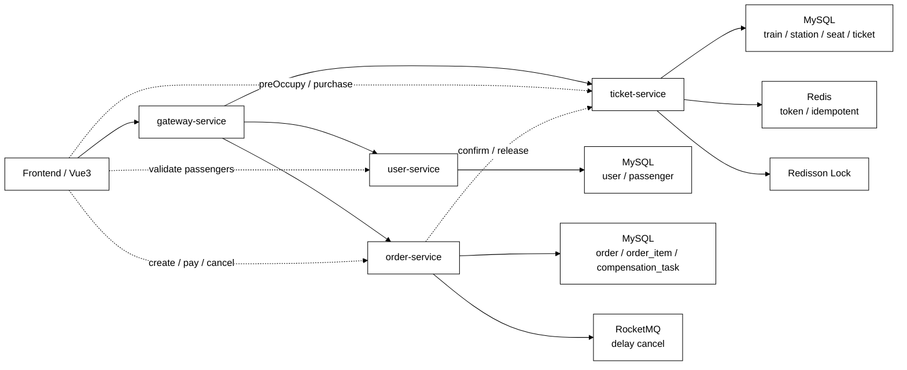
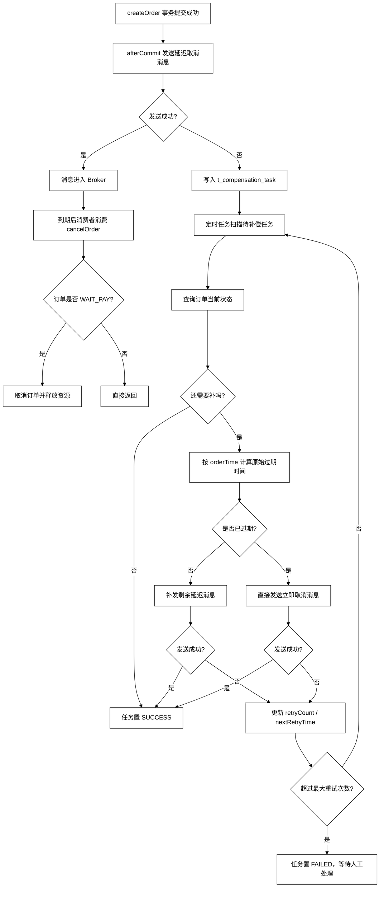

# TickGo

> 参考 12306 场景实现的区间购票与订单补偿系统，聚焦区间库存建模、并发锁座、防超卖、延迟取消、重复消费幂等与补偿重试。

[项目亮点](#项目亮点) · [系统架构](#系统架构) · [核心链路](#核心链路) · [关键设计](#关键设计) · [快速启动](#快速启动) · [后续优化](#后续优化)

## 项目亮点

- **区间库存模型**：不是简单按整趟车卖票，而是把物理座位拆成多个区间段 `segment`，支持按 `出发站 -> 到达站` 锁座和统计余票。
- **防超卖链路**：通过 **Redis token 前置拦截 + 购票入口幂等 + Redisson 分布式锁 + MySQL 条件更新** 控制高并发下的重复提交与并发锁座。
- **MySQL 最终兜底**：Redis 负责前置削峰和控制，真正决定是否成功锁座的是 MySQL 中的区间座位状态，保证最终库存一致性。
- **延迟取消与补偿**：使用 RocketMQ 延迟消息处理超时未支付订单；通过订单状态幂等判断处理重复消费；消息发送或资源释放失败时落补偿任务异步重试。

## 项目定位

TickGo 不是普通 CRUD 项目，而是围绕火车票区间售卖场景做的一个最小可运行系统。  
当前版本重点不在“功能多”，而在把后端常见的几个工程问题串到一条主链路里：

- 区间库存怎么建模
- 高并发下怎么尽量避免超卖
- 重复提交怎么拦
- 超时未支付怎么自动取消
- MQ 重复消费和发送失败怎么处理
- 事务外失败为什么要走补偿而不是回滚

## 技术栈

### 后端

- Java 17
- Spring Boot
- Spring Cloud Gateway
- OpenFeign
- MyBatis-Plus

### 数据与中间件

- MySQL
- Redis
- Redisson
- RocketMQ

### 前端

- Vue3
- TypeScript

## 系统架构



## 服务职责

### `gateway-service`

- 对外统一入口
- 根据路径转发到不同服务

### `user-service`

- 用户信息查询
- 乘车人信息管理
- 校验乘车人与当前用户关系

### `ticket-service`

- 查票
- Redis token 初始化与刷新
- 购票预占 / 锁座
- 支付成功后确认车票
- 取消或超时后释放座位
- 购票入口幂等控制

### `order-service`

- 创建订单与订单明细
- 支付订单
- 取消订单
- 发送延迟取消消息
- 补偿任务记录与重试

## 核心链路

### 1. 查票

1. 根据 `trainId + departure + arrival` 查询站点序号
2. 找出目标区间覆盖的所有座位段 `segment`
3. 只有目标区间内所有 `segment` 都可用，才认为该物理座位可售
4. 最终按 `seatType` 聚合余票

### 2. 下单 / 锁座

1. 校验乘车人信息
2. Redis token 做前置拦截
3. 购票入口幂等拦截重复提交
4. 以 `trainId + seatType` 等维度加分布式锁
5. 在 MySQL 中选择可用座位段并更新为已占用
6. 写入 `t_ticket`
7. 调用 `order-service` 创建订单

### 3. 支付确认

1. `order-service` 更新订单状态为已支付
2. 事务提交后调用 `ticket-service.confirm`
3. `ticket-service` 将对应车票状态改为已支付
4. 若确认失败，则记录补偿任务重试

### 4. 超时取消

1. 创建订单成功后发送 RocketMQ 延迟消息
2. 到期仍未支付则消费取消逻辑
3. `order-service.cancelOrder` 只允许 `WAIT_PAY -> CANCELED`
4. 事务提交后调用 `ticket-service.release`
5. 释放座位段并回收 token

## 关键设计

### 1. `t_seat` 区间段模型

一个物理座位不会只存一行，而是按相邻站点拆成多个区间段。

例如：

```text
01A 北京南 -> 济南西
01A 济南西 -> 南京南
01A 南京南 -> 杭州东
01A 杭州东 -> 宁波
```

这样做的价值：

- 能表达区间售票，而不是只卖整趟车
- 能复用不重叠区间的同一物理座位
- 锁座时只更新目标区间对应的座位段

### 2. 为什么不会超卖

当前版本的核心判断是：

- **Redis token**：负责前置削峰，减少无效请求直接打到数据库
- **分布式锁**：减少同一车次同一座席类型下的并发冲突
- **MySQL 条件更新**：真正决定锁座是否成功

也就是说，**Redis 和锁负责优化并发，MySQL 才是最终真实库存**。

### 3. 购票入口幂等

在 `ticket-service` 的购票入口增加幂等控制：

- 根据用户购票请求生成唯一指纹
- Redis 中记录 `PROCESSING / SUCCESS` 状态
- 重复请求不会再次进入锁座和下单逻辑

这部分解决的是**重复点击、网络重试、短时间重复请求**问题。

### 4. MQ 重复消费为什么要处理

延迟取消消息可能重复投递。  
如果不处理，真正危险的不是“重复取消订单”，而是取消后面绑定的副作用：

- 重复释放座位
- 重复回补 token
- 重复创建补偿任务

当前做法是基于订单状态机幂等：

- 只允许 `WAIT_PAY -> CANCELED`
- 如果消息再次消费时订单已是 `PAID` 或 `CANCELED`，直接返回

### 5. 为什么要做补偿任务

例如下面这种情况：

1. 订单已经成功提交
2. 事务提交后发送延迟消息失败

这时候订单已经落库，**不能再回滚**，只能补偿。  
所以会把未完成动作记到 `t_compensation_task`：

- 记录 `taskType`
- 记录 `bizId(orderSn)`
- 记录 `retryCount`
- 记录 `nextRetryTime`

由定时任务异步重试，保证最终一致性。

## 订单补偿流程图



## 项目里我重点做了什么

- 设计并实现区间座位段模型与查票逻辑
- 梳理购票主链路：查票、锁座、下单、支付确认、超时取消
- 补充购票入口幂等
- 完善 RocketMQ 延迟取消、重复消费安全处理和补偿任务
- 分析 Redis token 与 MySQL 最终库存的职责边界

## 当前边界

当前版本已经能演示核心链路，但我也明确知道它的边界：

1. 当前下单编排仍偏前端驱动，不是标准聚合服务编排
2. Redis token 方案还是较简化版本，区间粒度还有优化空间
3. 当前优先保证正确性，性能优化和更细粒度削峰仍可继续做

## 后续优化

- 用 **Redis Hash + Lua** 优化区间 token 的精细化扣减
- 将下单编排进一步收口到服务端聚合层
- 增加更完整的压测、监控与告警链路
- 优化选座策略，支持更合理的多乘客邻座分配

## 快速启动

### 环境依赖

- JDK 17
- MySQL 8.x
- Redis
- RocketMQ
- Node.js 18+

### 启动顺序

1. 执行 `resources/db` 下的建表 SQL
2. 启动 `user-service`
3. 启动 `ticket-service`
4. 启动 `order-service`
5. 启动 `gateway-service`
6. 启动 `frontend`

### 默认入口

- 网关：`http://localhost:8080`
- 前端：`http://localhost:5173`

## 适合面试展开的问题

- 为什么区间购票不能只用一张简单座位表
- Redis token、分布式锁、MySQL 条件更新分别解决什么问题
- 为什么 MySQL 才是最终真实库存
- MQ 为什么会重复消费，为什么不能忽略
- 回滚和补偿有什么区别
- 为什么补偿不能重新开始算一轮超时时间
